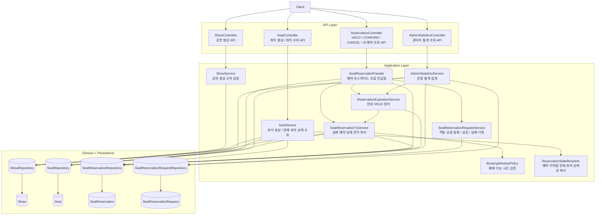
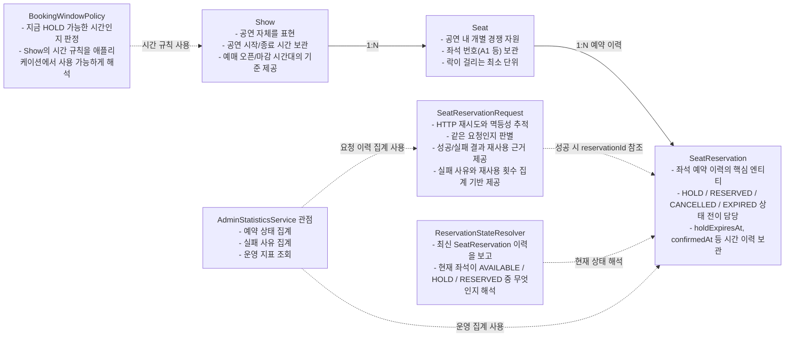

# Seat Reservation System Architecture

이 문서는 좌석 예매 시스템의 전체 구조와 각 도메인 객체의 역할과 책임을 설계 관점에서 정리한다.
세부 구현보다는 시스템을 어떤 책임 단위로 나누었는지, 각 컴포넌트가 무엇을 담당하는지에 초점을 둔다.

## 1. 시스템 설계 개요

이 시스템은 크게 네 층으로 나뉜다.

- API Layer: HTTP 요청을 받고 응답을 반환한다.
- Application Layer: 유스케이스를 조합하고 트랜잭션 경계를 관리한다.
- Domain Layer: 공연, 좌석, 예약, 요청 이력 같은 핵심 개념과 상태 전이 규칙을 표현한다.
- Persistence Layer: 각 도메인 객체를 저장하고 조회한다.

핵심 설계 의도는 다음과 같다.

- 좌석 경쟁은 `Seat`를 기준으로 직렬화한다.
- 예약 상태 관리는 `SeatReservation` 이력 중심으로 처리한다.
- HTTP 재시도와 멱등성은 `SeatReservationRequest`로 분리한다.
- 운영 통계와 조회용 상태 해석은 별도 서비스에서 담당한다.

## 2. 전체 시스템 구조

## 3. 주요 컴포넌트 역할과 책임

### API Layer

- `ShowController`
  - 공연 생성 요청을 받는다.
  - 입력을 `ShowService`로 전달하고 응답 DTO를 반환한다.

- `SeatController`
  - 좌석 생성과 좌석 목록 조회 요청을 처리한다.
  - 클라이언트가 현재 좌석 상태를 확인하는 진입점이다.

- `ReservationController`
  - HOLD, CONFIRM, CANCEL, 내 예약 조회를 처리한다.
  - 예약 관련 유스케이스를 `SeatReservationFacade` 하나로 위임한다.

- `AdminStatisticsController`
  - 관리자용 통계 조회를 제공한다.

### Application Layer

- `ShowService`
  - 공연 생성 규칙을 검증한다.
  - 공연 시간과 예매 가능 시간대의 기본 정합성을 보장한다.

- `SeatService`
  - 좌석 생성 규칙을 검증한다.
  - 좌석 목록 조회 시 최신 예약 이력을 바탕으로 현재 좌석 상태를 계산한다.

- `SeatReservationFacade`
  - 예약 유스케이스의 조합 진입점이다.
  - 멱등 요청 등록, 실제 예약 처리, 결과 재사용, 내 예약 조회 흐름을 조율한다.

- `SeatReservationTxService`
  - 좌석 HOLD, 확정, 취소, 만료 같은 실제 상태 전이를 수행한다.
  - 좌석 경쟁이 발생하는 핵심 트랜잭션 경계를 담당한다.

- `SeatReservationRequestService`
  - 멱등 요청을 등록하고 성공/실패 결과를 기록한다.
  - HTTP 재시도와 요청 결과 재사용을 가능하게 한다.

- `ReservationExpirationService`
  - 만료된 HOLD를 정리한다.
  - lazy expiration을 보완하는 cleanup 역할을 수행한다.

- `BookingWindowPolicy`
  - 현재 시점이 예매 가능한 시간인지 판정한다.
  - 예매 가능 시간 규칙을 서비스 계층에서 재사용 가능한 정책으로 분리한다.

- `ReservationStateResolver`
  - 예약 이력을 조회용 현재 상태로 해석한다.
  - 좌석이 `AVAILABLE`, `HOLD`, `RESERVED` 중 무엇인지 계산한다.

- `AdminStatisticsService`
  - 예약 상태 수, 실패 요청 수, 실패 사유, 멱등 재사용 횟수 같은 운영 지표를 집계한다.

## 4. 도메인 객체 중심 설계

## 5. 도메인 객체별 책임

### `Show`

- 공연 정보를 표현한다.
- 공연 시작/종료 시각과 예매 오픈/마감 시각을 보관한다.
- 예매 가능 여부 판정의 기준 데이터를 제공한다.

### `Seat`

- 공연 안에서 실제 경쟁이 일어나는 개별 자원이다.
- 좌석 번호를 식별자로 관리한다.
- 동시성 제어에서 잠금 단위가 되는 대상이다.

### `SeatReservation`

- 좌석 예약 상태 전이의 중심 엔티티다.
- `HOLD`, `RESERVED`, `CANCELLED`, `EXPIRED` 상태를 가진다.
- 확정, 취소, 만료 같은 행위를 자신의 상태 규칙 안에서 처리한다.
- 좌석의 현재 상태를 직접 저장하는 것이 아니라, 예약 이력과 상태 전이를 통해 현재 의미를 만든다.

### `SeatReservationRequest`

- 예약 요청 자체를 기록하는 엔티티다.
- `Idempotency-Key`와 사용자, 좌석, 공연 조합을 기반으로 같은 요청을 식별한다.
- 이전 성공/실패 결과를 재사용하게 해준다.
- 실패 사유와 재사용 횟수를 남겨 운영 분석에도 활용된다.

## 6. 설계 관점에서 본 핵심 분리

- 좌석 점유 문제와 요청 재시도 문제를 분리했다.
  - 좌석 점유는 `Seat` + `SeatReservation`
  - 요청 재시도와 멱등성은 `SeatReservationRequest`

- 상태 변경과 조회 해석을 분리했다.
  - 상태 변경은 `SeatReservationTxService`
  - 조회용 현재 상태 해석은 `ReservationStateResolver`

- 비즈니스 처리와 운영 관점 집계를 분리했다.
  - 실제 예약 처리 흐름은 `SeatReservationFacade`, `SeatReservationTxService`
  - 운영 통계는 `AdminStatisticsService`

## 7. 한 줄 요약

이 시스템은 `Seat`를 경쟁 자원으로 보고, `SeatReservation`으로 상태 전이를 관리하며, `SeatReservationRequest`로 멱등성과 요청 이력을 분리해 다루는 구조다.
